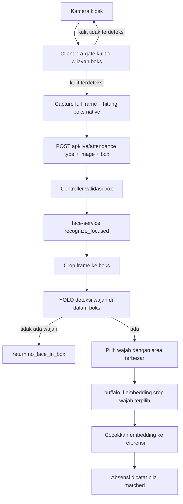

# Rencana Implementasi — Prioritas Wajah Terdekat & Dalam Boks (cam_live)

## 1. Latar Belakang / Masalah

Pada kiosk absensi wajah [`app/public/cam_live.html`](../app/public/cam_live.html), sering terjadi:
saat team IT membantu user melakukan absensi, yang terdeteksi dan tercatat justru team IT, bukan user.

Dua kebutuhan yang diminta user:
1. Memprioritaskan wajah yang **paling dekat ke kamera**.
2. Memprioritaskan wajah yang **berada di dalam boks panduan** kamera.

## 2. Root Cause (hasil analisa)

- **API `window.FaceDetector` (Shape Detection API) sudah mati.** Sempat hanya aktif di belakang
  flag eksperimental dan **dihapus dari Chrome sejak v91 (2021)** — tidak tersedia di Chrome desktop
  maupun Chrome Android. Akibatnya cabang [`detectWithApi()`](../app/public/js/live.js:262) **tidak pernah
  berjalan**; yang aktif hanyalah heuristik kulit [`detectSkinFace()`](../app/public/js/live.js:280) yang
  hanya mengecek ada/tidaknya warna kulit di wilayah tengah frame.
- **Capture mengirim seluruh frame** ([`camImage()`](../app/public/js/live.js:169)) tanpa seleksi wajah.
- **Server memilih kandidat dengan skor tertinggi di antara SEMUA wajah** — [`recognize()`](../face-service/main.py:213)
  menggabungkan semua probe lalu mengambil `best`. Wajah terbesar/terdekat yang sudah terdaftar (biasanya
  team IT) yang menang, bukan user.

## 3. Pendekatan: Opsi C (hybrid)

- **Client** (pra-gate ringan, tanpa dependency):
  - Heuristik kulit [`detectSkinFace()`](../app/public/js/live.js:280) dipersempit ke **wilayah boks
    panduan** (bukan area tengah yang luas) → mencegah submit saat tidak ada orang di dalam boks.
  - Mengirim **koordinat boks** (normalized `[x1, y1, x2, y2]` dalam ruang koordinat video native)
    bersama frame.
- **Server** (otoritatif):
  - Endpoint baru `recognize_focused` → **crop ke boks** → deteksi YOLO → **pilih wajah TERBESAR**
    (proxy "paling dekat") → recognisi **hanya wajah itu** → cocokkan ke referensi.

Tidak bergantung pada `FaceDetector` yang sudah mati; tidak menambah dependency/model di client.

## 4. Alur Baru

## 5. Perubahan per File

### 5.1 [`face-service/main.py`](../face-service/main.py) — inti seleksi
1. **`RecognizeRequest`**: tambah field opsional
   `box: list[float] | None = None` — normalized `[x1, y1, x2, y2]` dalam 0..1.
2. **Helper baru `largest_face_embedding(image, box=None)`**:
   - Jika `box` ada → crop `image[y1*h:y2*h, x1*w:x2*w]` (clamp koordinat).
   - `yolo_face_crops(...)` pada hasil crop → jika tidak ada → kembalikan `None` + reason:
     - `no_face_in_box` jika `box` diberikan, atau `no_face` jika tidak.
   - Dari crop YOLO pilih **area terbesar** → jalankan buffalo_l hanya pada crop itu → dari deteksi
     buffalo_l pilih wajah dengan bounding box terbesar (wajah dominan).
3. **Endpoint baru `POST /recognize_focused`**:
   - Decode image → `largest_face_embedding(image, payload.box)`.
   - Jika tidak ada embedding → `{matched: false, reason: ...}`.
   - `score_all([embedding])` → `no_reference_faces` bila kosong → `below_threshold` bila di bawah
     ambang → sebaliknya `{matched: true, fid, score, file}` (bentuk respons sama dengan `/recognize`).
4. **Non-regresi**: [`image_embeddings()`](../face-service/main.py:103), `/recognize`, `/recognize_multi`,
   dan `reload_index` **tidak diubah** (semua wajah tetap diproses untuk referensi & multi).

### 5.2 [`app/controllers/live.js`](../app/controllers/live.js)
1. **Helper [`recognize()`](../app/controllers/live.js:50)**: tambah parameter `opts` (mis. `{ box }`) dan
   terusan field ke body JSON: `JSON.stringify({ image, ...(box ? { box } : {}) })`.
2. **Handler [`attendance()`](../app/controllers/live.js:88)**:
   - Baca `req.body.box`; validasi: array 4 angka dalam 0..1 dengan `x1 < x2`, `y1 < y3`, wajib
     konsisten; bila tidak valid → `400 INVALID_BOX` (box bersifat opsional, boleh kosong).
   - Panggil `recognize(image, 'recognize_focused', { box })`.
3. **`faceNotFoundMessage()`**: tambah
   `case 'no_face_in_box'` → pesan "Wajah tidak berada di dalam bingkai. Posisikan wajah di tengah
   boks lalu scan ulang."

### 5.3 [`app/public/js/live.js`](../app/public/js/live.js)
1. **Konstanta boks**: `GUIDE_INSET_X = 0.22`, `GUIDE_INSET_Y = 0.12` (selaras CSS
   [`live.css`](../app/public/css/live.css:303) `inset: 12% 22%`).
2. **Helper baru `guideBoxNative()`** → `{ x1, y1, x2, y2 }` normalized dalam **koordinat video native**:
   - Ambil `getBoundingClientRect()` video (area display hasil `object-fit: cover`) dan boks
     `.live-face-guide`.
   - Petakan boks display → native dengan rumus cover: `scale = max(rectW/nativeW, rectH/nativeH)`,
     lalu `nativeX = (boxX - offsetX)/scale`.
   - Fallback: proporsi `GUIDE_INSET_*` bila mapping gagal.
   - Catatan: boks simetris di tengah sehingga mirror `scaleX(-1)` tidak menggeser posisi boks.
3. **`detectSkinFace()`**: wilayah sampel disamakan dengan boks (x: 0.22–0.78, y: 0.12–0.88 pada canvas
   analisis 160x120); naikkan ambang skin fraction dari `0.035` ke `0.05` untuk mengurangi false positive.
4. **`captureAndSubmit()`**: hitung `box = guideBoxNative()` dan sertakan di body
   `JSON.stringify({ type, image, box })`. [`camImage()`](../app/public/js/live.js:169) tetap mengirim
   full frame (crop dilakukan di server).

### 5.4 Tes
1. [`app/tests/live-controller.test.js`](../app/tests/live-controller.test.js): tambah unit test
   validasi `box` (valid / invalid / absent) dan pemetaan reason `no_face_in_box`. Pastikan tes lama tetap hijau.
2. Face-service: verifikasi manual via curl
   (`POST /recognize_focused` dengan dan tanpa `box`) karena belum ada harness test Python.

## 6. Non-Regresi & Backward Compatibility
- `/recognize` dan `/recognize_multi` serta `reload_index` tidak berubah.
- `box` opsional: bila client lama tidak mengirim `box`, `recognize_focused` tetap memilih wajah
  terbesar di seluruh frame (fitur "terdekat" tetap berjalan; fitur "dalam boks" mengandalkan default).
- `shouldRetry()` client tidak berubah: `no_face_in_box` termasuk 404 yang dapat di-retry otomatis.

## 7. Risiko & Keputusan
- **Mapping display→native**: satu-satunya bagian yang perlu hati-hati; diformulasikan di
  `guideBoxNative()` dan punya fallback proporsional. Frame 4:3 + stream 640x480 (rasio sama) membuat
  mapping linier.
- **Ambang kulit**: terlalu ketat → false negative (wajah gelap/remang). Dipilih 0.05 sebagai kompromi;
  server tetap otoritatif.
- **Latensi**: tetap 1 request (YOLO+buffalo_l sudah dijalankan per request saat ini); hanya logika
  pemilihan yang berubah.

## 8. Di Luar Lingkup
- [`multi_live.html`](../app/public/multi_live.html) / `recognize_multi` tidak diubah.
- Optimasi crop penuh di client (payload lebih kecil) dicatat sebagai enhancement masa depan.
