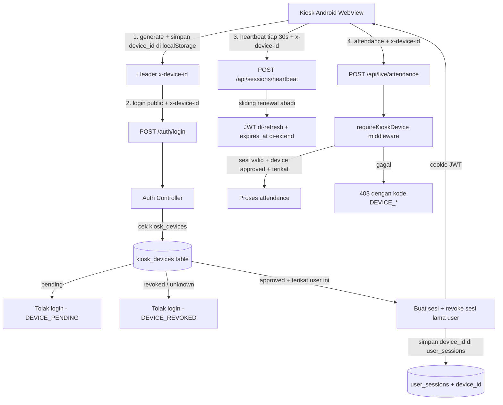

# Rencana: Kiosk Attendance `public` — Sesi Abadi + 1 User 1 Device + Device Approval

## Tujuan

Memenuhi 4 requirement yang sudah dikunci bersama:

1. **Sesi `public` benar-benar abadi** — sliding renewal agresif sehingga kiosk tidak pernah login ulang selama online.
2. **1 user = 1 device global** — satu akun `public` hanya boleh aktif di satu device dalam satu waktu.
3. **Approval device wajib** — setiap device kiosk harus di-approve admin sebelum bisa akses.
4. **Endpoint attendance ikut digerbang** — `/api/live/*` (attendance, multi-recognize, multi-attendance) hanya bisa dipanggil dari device yang sudah di-approve + sesi `public` valid.

Tidak mengubah perilaku role lain (`superadmin`, `admin`, `viewer`).

---

## Arsitektur Konseptual



---

## Perubahan Backend

### 1. Skema Database — [`app/utils/database.js`](../../app/utils/database.js)

Tabel baru `kiosk_devices` (tambahkan di `ensureSchema`):

```sql
CREATE TABLE IF NOT EXISTS kiosk_devices (
  id BIGSERIAL PRIMARY KEY,
  device_id TEXT NOT NULL UNIQUE,        -- UUID dihasilkan klien (persisten di localStorage)
  name TEXT DEFAULT '',                   -- label device, mis. "Kiosk Lobby"
  status TEXT NOT NULL DEFAULT 'pending', -- pending | approved | revoked
  user_id INTEGER REFERENCES users(id) ON DELETE SET NULL, -- binding ke akun public
  approved_by TEXT,                       -- username superadmin yang approve
  approved_at TIMESTAMPTZ,
  revoked_at TIMESTAMPTZ,
  last_seen TIMESTAMPTZ,                  -- terakhir heartbeat
  first_seen_at TIMESTAMPTZ DEFAULT now(),
  created_at TIMESTAMPTZ DEFAULT now()
);
CREATE INDEX IF NOT EXISTS idx_kiosk_devices_status ON kiosk_devices (status);
CREATE INDEX IF NOT EXISTS idx_kiosk_devices_user ON kiosk_devices (user_id);
```

Kolom baru di `user_sessions` (untuk R2 — 1 user 1 device):

```sql
ALTER TABLE user_sessions ADD COLUMN IF NOT EXISTS device_id TEXT;
CREATE INDEX IF NOT EXISTS idx_user_sessions_device ON user_sessions (device_id);
```

**Alasan** `device_id` di `user_sessions`: memungkinkan deteksi "user `public` login dari device lain" dan revoke otomatis sesi lama saat device yang sama re-register/re-approve.

### 2. Config — [`app/config/index.js`](../../app/config/index.js)

- `SLIDING_SESSION_ROLES` sudah default `public` — biarkan.
- Tambah `PUBLIC_SESSION_TTL_MS` (default, mis. 365 hari) untuk TTL login role `public`.
- Tambah `KIOSK_DEVICE_HEADER` (default `x-device-id`) supaya nama header mudah diubah.
- Perbarui komentar `SLIDING_SESSION_RENEW_THRESHOLD_MS` — untuk `public` renewal dipicu di setiap heartbeat (threshold menjadi "selalu").

### 3. Controller baru — `app/controllers/kiosk-device.js`

Mengikuti pattern `pagePermissionsController` (import `pool`, `recordActivity`, `sendSuccess`, `sendError`):

| Method | Deskripsi |
|---|---|
| `register(req)` | Daftar/update device: `device_id` wajib. Bila belum ada → insert `pending` (upsert). Update `first_seen_at`. Dipanggil klien sebelum login (endpoint terbuka, hanya butuh `device_id`). |
| `list(req)` | List semua `kiosk_devices` (Super Admin). |
| `approve(req)` | Set `status=approved`, `user_id` (wajib diisi — akun `public` yang akan dipakai), `approved_by`, `approved_at`. Revoke sesi lama user tsb supaya binding bersih. |
| `revoke(req)` | Set `status=revoked`, `revoked_at`, hapus `user_id`. Revoke semua sesi device tsb. |
| `rename(req)` | Ubah label `name` device. |
| `unbind(req)` | Lepas `user_id` tanpa revoke device (untuk assign ulang). |

Log semua aksi via `recordActivity` (kategori `settings` atau `auth`, action `approve_kiosk_device` dst).

### 4. Auth Controller — [`app/controllers/auth.js`](../../app/controllers/auth.js) (`login`)

Setelah verifikasi password berhasil, **hanya untuk role `public`**:

1. Baca `device_id` dari header `x-device-id` (nama configurable). Wajib ada — tanpa itu tolak `400`/`403` dengan kode `DEVICE_REQUIRED`.
2. Cek `kiosk_devices`:
   - Tidak ada → `403` `DEVICE_UNREGISTERED` (pesan: "Device belum terdaftar").
   - `status = pending` → `403` `DEVICE_PENDING` (pesan: "Menunggu approval admin").
   - `status = revoked` → `403` `DEVICE_REVOKED`.
   - `status = approved` tapi `user_id` tidak sama dengan user ini → `403` `DEVICE_BOUND_OTHER` (1 device = 1 user).
3. Jika lolos: `jti` seperti biasa, tapi `expiresIn` = `PUBLIC_SESSION_TTL_MS` (bukan 3 hari).
4. `createSession` diisi `device_id`.
5. **Revoke semua sesi lain user ini** via `revokeAllUserSessions(user.id, exceptJti=jti)` — menggantikan (atau melengkapi) `revokeDuplicateDeviceSessions` untuk role `public`. Ini menegakkan 1 user = 1 device global.
6. Cookie `maxAge` = `PUBLIC_SESSION_TTL_MS` untuk role `public`.

**Penting:** untuk role non-`public`, alur login tetap seperti sekarang (3 hari, dedupe per device).

### 5. Sessions Utils — [`app/utils/sessions.js`](../../app/utils/sessions.js)

- `createSession`: terima parameter opsional `deviceId`, simpan ke kolom `device_id`.
- `touchSession`: tetap seperti sekarang.
- Tambah helper `revokeDeviceSessions(deviceId, revokedBy)` — revoke semua sesi aktif dengan `device_id` tsb (dipakai saat device di-revoke/unbind/approve ulang).
- `listSessions` / `getSessionByJti`: sertakan `device_id` di SELECT supaya tampil di halaman Active Sessions.

### 6. Sessions Controller — [`app/controllers/sessions.js`](../../app/controllers/sessions.js) (`heartbeat`)

Untuk R1 (sesi abadi):

- Untuk role dalam `SLIDING_SESSION_ROLES`, **renewal dipicu di setiap heartbeat**, bukan hanya saat sisa < threshold. Setelah renewal, `remaining` dihitung ulang sehingga secara efektif tidak pernah mendekati kadaluarsa.
- `extendSessionExpiry` memakai `PUBLIC_SESSION_TTL_MS`.
- Baca & validasi `x-device-id` di heartbeat juga — jika device di-revoke, heartbeat menolak (401/403) dan kiosk logout.

### 7. Middleware baru — `app/middleware/kiosk-device.js`

`requireKioskDevice` — dipasang di route `/api/live/*` yang selama ini terbuka:

1. Wajib sesi JWT valid (`requireAuth` semantik) — role `public` atau `superadmin`.
2. Baca `device_id` dari header.
3. Untuk role `public`: cek `kiosk_devices` approved + `user_id` == user sesi. Gagal → `403` dengan kode `DEVICE_PENDING` / `DEVICE_REVOKED` / `DEVICE_UNREGISTERED`.
4. Untuk role `superadmin`: izinkan (untuk pengujian/troubleshooting), atau tolak bila header `device_id` dianggap wajib — **keputusan implementasi**: biarkan superadmin tembus supaya admin bisa tes tanpa device fisik.
5. Update `last_seen` di `kiosk_devices` (throttle, mis. tiap 60s).

**Perhatian kompatibilitas:** saat ini `/api/live/*` terbuka tanpa auth. Setelah perubahan ini, semua klien kiosk wajib login `public` dulu. Karena `/live.html` sudah butuh `requirePageAuth`, kiosk normal (buka `/live.html` → ambil attendance) sudah punya cookie. Namun `/cam_live.html` & `/multi_live.html` adalah halaman statis yang saat ini bisa dibuka tanpa login — halaman ini harus ikut dilindungi `requirePageAuth` di [`app/server.js`](../../app/server.js) (R4), supaya "gak sembarang device bisa akses".

### 8. Routes

**`app/routes/live.js`** — pasang `requireKioskDevice` pada:
- `POST /attendance`
- `POST /multi-recognize`
- `POST /multi-attendance`
- (`GET /health` sudah `requireAuth` + `pageAccess`)

**`app/routes/api.js`** — tambah route admin (Super Admin):
- `GET /kiosk-devices` → list
- `POST /kiosk-devices/register` → register (terbuka, hanya butuh `device_id` header)
- `PUT /kiosk-devices/:id/approve` → approve + assign user
- `PUT /kiosk-devices/:id/revoke` → revoke
- `PUT /kiosk-devices/:id/rename` → rename
- `PUT /kiosk-devices/:id/unbind` → unbind user

**`app/routes/auth.js`** — tidak perlu route baru; `device_id` dibaca dari header di dalam `login`.

---

## Perubahan Frontend

### 1. Identifikasi device — `app/public/js/utils.js` (atau modul kecil baru `app/public/js/device.js`)

Helper:
- `getDeviceId()` — baca `localStorage.getItem('kiosk_device_id')`; bila kosong, generate `crypto.randomUUID()` lalu simpan.
- `deviceHeaders()` — kembalikan `{ 'x-device-id': getDeviceId() }` untuk disisipkan ke semua fetch terkait kiosk (login, heartbeat, attendance).

### 2. Login — [`app/public/js/auth.js`](../../app/public/js/auth.js) (`handleLogin`)

- Sisipkan `x-device-id` header pada POST `/auth/login`.
- Tangani kode error khusus dari server: `DEVICE_PENDING`, `DEVICE_REVOKED`, `DEVICE_UNREGISTERED`, `DEVICE_BOUND_OTHER` → tampilkan pesan ramah di form login (mis. "Device ini menunggu persetujuan admin", "Device ini telah dicabut aksesnya").

### 3. Heartbeat — [`app/public/js/auth.js`](../../app/public/js/auth.js) (`startSessionHeartbeat`)

- Sisipkan `x-device-id` header pada POST `/api/sessions/heartbeat`.

### 4. Attendance — [`app/public/js/live.js`](../../app/public/js/live.js), [`app/public/js/multi-live.js`](../../app/public/js/multi-live.js)

- Semua fetch ke `/api/live/*` disisipkan `x-device-id`.
- Tangani `403` dengan kode `DEVICE_*`: tampilkan layar "Device tidak diizinkan / menunggu approval" dan jangan auto-retry tanpa henti.

### 5. Halaman Admin baru — `app/public/pages/kiosk-devices.html` + `app/public/js/pages/kiosk-devices.js`

Mirip halaman `sessions`/`settings` (Super Admin only):

- Tabel daftar `kiosk_devices`: device_id (dipendekkan), nama, status (badge pending/approved/revoked), user terikat, first_seen, last_seen.
- Aksi: Approve (modal pilih akun `public` dari list `/auth/users`), Revoke, Rename, Unbind.
- Navigasi: tambah item menu di [`app/public/index.html`](../../app/public/index.html) di submenu Settings (`superadmin-only`, `onclick="showPage('kiosk-devices')"`) + daftar `allowedPages` di [`app/public/app.js`](../../app/public/app.js).

---

## Alur Lengkap (User Story)

### Skenario A — Kiosk baru pertama kali menyala
1. WebView buka `/` → halaman login.
2. `device.js` generate `device_id`, simpan di localStorage.
3. Login `public` + header `device_id` → server: device belum terdaftar → `403 DEVICE_UNREGISTERED`.
4. Kiosk tampilkan pesan "Hubungi admin untuk mendaftarkan device ini" + tombol "Daftarkan" (panggil `POST /api/kiosk-devices/register` sekali, lalu tampilkan "Menunggu approval").
   - **Alternatif:** registrasi otomatis pada percobaan login pertama (upsert `pending`) supaya admin tinggal approve dari dashboard. — *keputusan implementasi, default: auto-register on first login attempt.*

### Skenario B — Admin approve
1. Admin buka Settings → Kiosk Devices.
2. Lihat device `pending`, klik Approve, pilih akun `public` → simpan.
3. Server set `approved` + `user_id`, revoke sesi lama user tsb (jika ada).

### Skenario C — Kiosk login setelah approved
1. Login `public` + `device_id` → lolos cek → sesi dibuat, `device_id` tersimpan, sesi lain user tsb direvoke.
2. Sesi di-refresh terus via heartbeat → **abadi selama online**.
3. Attendance berhasil diproses.

### Skenario D — Device dicabut / dihapus akses
1. Admin klik Revoke → `status=revoked`, sesi device di-revoke.
2. Heartbeat berikutnya dari device tsb ditolak `403` → kiosk logout & tampilkan "Akses device dicabut".

### Skenario E — User `public` mencoba login dari device kedua
1. Device kedua (belum approved/terikat) login → ditolak `DEVICE_PENDING` / `DEVICE_UNREGISTERED` / `DEVICE_BOUND_OTHER`.
2. Jika device kedua terdaftar & approved tapi diikat ke user lain → `DEVICE_BOUND_OTHER`.

---

## Kode Error API (kontrak dengan frontend)

| Kode | HTTP | Makna |
|---|---|---|
| `DEVICE_REQUIRED` | 400 | Header `x-device-id` tidak dikirim |
| `DEVICE_UNREGISTERED` | 403 | Device belum terdaftar |
| `DEVICE_PENDING` | 403 | Device menunggu approval |
| `DEVICE_REVOKED` | 403 | Device dicabut aksesnya |
| `DEVICE_BOUND_OTHER` | 403 | Device terikat ke akun public lain |

Format: `sendError(res, message, 403)` + properti `code` (ikuti pola `sendLiveError` di [`app/controllers/live.js`](../../app/controllers/live.js:25)).

---

## Daftar File yang Diubah / Dibuat

**Backend:**
- `app/utils/database.js` — tabel `kiosk_devices` + kolom `device_id` di `user_sessions`
- `app/config/index.js` — `PUBLIC_SESSION_TTL_MS`, `KIOSK_DEVICE_HEADER`
- `app/controllers/kiosk-device.js` — **baru**
- `app/controllers/auth.js` — validasi device pada login `public`
- `app/utils/sessions.js` — `deviceId` di createSession, `revokeDeviceSessions`
- `app/controllers/sessions.js` — heartbeat renewal agresif + validasi device
- `app/middleware/kiosk-device.js` — **baru**
- `app/routes/live.js` — pasang middleware
- `app/routes/api.js` — route admin kiosk-device
- `app/routes/index.js` — ekspor controller kiosk-device
- `app/server.js` — lindungi `cam_live.html` / `multi_live.html` dengan `requirePageAuth`

**Frontend:**
- `app/public/js/device.js` — **baru** (getDeviceId, deviceHeaders)
- `app/public/js/auth.js` — header device pada login & heartbeat + handling error
- `app/public/js/live.js`, `app/public/js/multi-live.js` — header device + handling 403
- `app/public/pages/kiosk-devices.html` — **baru**
- `app/public/js/pages/kiosk-devices.js` — **baru**
- `app/public/index.html` — item menu
- `app/public/app.js` — `allowedPages` + label

**Dokumentasi:**
- `API_DOCUMENTATION.md`, `Documentation.md` — endpoint baru & kode error

---

## Catatan Migrasi / Kompatibilitas

- **Backward compat:** tabel baru + kolom baru memakai `CREATE TABLE IF NOT EXISTS` / `ADD COLUMN IF NOT EXISTS` di `ensureSchema` — aman untuk instalasi lama.
- **Efek ke kiosk yang sudah berjalan:** setelah deploy, semua kiosk `public` yang lama harus melalui registrasi + approval sekali. Karena `device_id` baru dibuat saat pertama kali halaman dimuat, kiosk lama otomatis jadi `pending` pada login pertama.
- **Efek ke role lain:** tidak ada perubahan perilaku login `superadmin/admin/viewer`.
- **`/cam_live.html` & `/multi_live.html`** yang sekarang bisa dibuka langsung akan butuh login setelah perubahan — konfirmasi apakah kiosk fisik memang selalu melewati `/live.html` (yang sudah butuh login). Jika ada deploy yang mengandalkan akses langsung tanpa login, perlu penyesuaian.

---

## Langkah Eksekusi (untuk mode Code)

1. Skema DB: tabel `kiosk_devices` + kolom `device_id` di `user_sessions` di `ensureSchema`.
2. Config baru di `app/config/index.js`.
3. `app/controllers/kiosk-device.js` (register/list/approve/revoke/rename/unbind) + export di `app/controllers/index.js` + routes di `app/routes/api.js`.
4. Login `public`: validasi device + TTL panjang + `device_id` di `createSession` + `revokeAllUserSessions`.
5. `app/utils/sessions.js`: dukung `deviceId` + `revokeDeviceSessions` + sertakan `device_id` di list/get.
6. Heartbeat: renewal agresif + validasi device (revoke).
7. Middleware `app/middleware/kiosk-device.js` + pasang di `app/routes/live.js`.
8. Lindungi `cam_live.html`/`multi_live.html` di `app/server.js`.
9. Frontend: `device.js`, header di auth.js/live.js/multi-live.js, handling kode error.
10. Halaman admin kiosk-devices + menu.
11. Update dokumentasi API.
12. Uji: skenario A–E di atas (login pending/approved/revoked, sesi abadi, 1 user 1 device, gate attendance).
