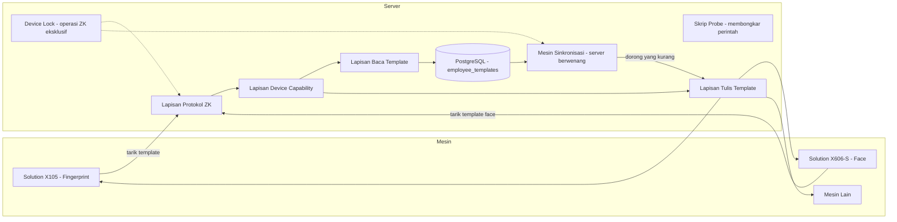

# Rencana: Sinkronisasi Template Fingerprint & Face (Solution X105 / X606-S) — Server sebagai Sumber Kebenaran

## Tujuan
Menambahkan sinkronisasi **template sidik jari (fingerprint)** dan **template wajah (face)** untuk **Solution X105 dan X606-S** melalui **protokol TCP ZKTeco (port 4370)** — dengan server sebagai sumber data yang paling berwenang (source of truth). **Tanpa** bergantung pada software Solution Attendance Management.

## Keputusan (sudah dikonfirmasi dengan user)
- **Arah sinkronisasi:** Satu arah. Tarik (pull) template dari satu mesin **master** ke database, lalu dorong (push) ke semua mesin lain. Server selalu yang paling berwenang.
- **Face:** WAJIB. Implementasikan baca/tulis template wajah lewat protokol ZK mentah untuk X606-S dan X105 sebagai fitur utama, dengan skrip probe khusus untuk membongkar kumpulan perintah face.
- **Pemilihan master:** Tambah flag boolean `is_template_master` pada tabel `devices`, bisa dipilih di UI Devices/Settings.
- **Validasi:** Akses langsung ke X105 dan X606-S (LAN/VPN) tersedia untuk menjalankan skrip probe.

## Kondisi Saat Ini (yang sudah ada)
- Sinkronisasi ganda: ADMS PUSH (HTTP `/iclock`) + ZKTeco PULL (TCP 4370) via `node-zklib` v1.3.0 (sudah di-patch untuk penanganan chunk FW8+).
- [`fetchFingerprintCounts()`](app/utils/zklib-employee.js:71) — hanya menghitung jumlah sidik jari, dengan cara `executeCmd(9)` yang rapuh.
- [`check-fp.mjs`](app/check-fp.mjs:1) — skrip debug yang membuktikan `readWithBuffer` (tabel=2) bisa membaca rekaman template sidik jari.
- [`syncServerToDevice()`](app/utils/zklib-employee.js:265) — hanya mengirim identitas user (nama/userId), **tidak mengirim template**.
- Perintah ZK yang tersedia: `CMD_USERTEMP_RRQ=9`, `CMD_USERTEMP_WRQ=10`, `CMD_DELETE_USERTEMP=19`. **Perintah face TIDAK ada** di node-zklib.
- Tabel `employee` punya kolom `fingerprint_count` tapi belum ada penyimpanan template biner.

## Arsitektur



### Batas layer dan aturan dependensi

- **Lapisan protokol ZK** hanya menangani TCP, command, header, ACK, buffer, chunking, dan lifecycle koneksi; tidak boleh mengambil keputusan rekonsiliasi atau mengakses tabel bisnis.
- **Lapisan device capability** memilih perilaku berdasarkan model, firmware, SN, dan hasil probe yang tersimpan; default-nya deny untuk operasi template yang belum terbukti.
- **Lapisan template sync engine** menghitung diff server-versus-device, menjalankan dry-run, reconciliation, audit, retry, dan histori; engine memanggil protokol melalui capability, bukan memakai konstanta command langsung.
- Semua operasi ZK (attendance, ADMS/PULL yang memakai koneksi ZK, dan template sync) wajib melewati device lock yang sama.

## Capability Matrix — Sumber Kebenaran Hasil Probe

Semua perilaku implementasi template **WAJIB** dipilih dari matrix ini, bukan dari asumsi model atau konstanta protokol. Satu baris mewakili kombinasi `model + firmware`; baris untuk firmware yang belum diprobe tidak boleh dianggap kompatibel. Nilai `UNKNOWN` berarti fitur belum terbukti dan harus diperlakukan sebagai tidak didukung oleh mesin sinkronisasi.

| Model / firmware | SN perangkat | Fingerprint — read command & status | Fingerprint — write command & ACK | Face — read command & status | Face — write command & ACK | Format payload / record yang terbukti | Ukuran maksimum terukur / batas paket | Chunking | Batasan lain / keputusan runtime | Probe terakhir / bukti |
|---|---|---|---|---|---|---|---:|---|---|---|
| Solution X105 / `UNKNOWN` | `UNKNOWN` | `readWithBuffer(table=2)` dengan request `01 07 00 02 ...`; status `PROBE_REQUIRED` | `CMD_USERTEMP_WRQ (10)` + ACK `PROBE_REQUIRED`; alternatif `CMD_TMP_WRITE (87)` | `UNKNOWN` | `UNKNOWN` | Fingerprint: record diawali `size:uint16le`, `uid:uint16le`, `fingerId:uint8`, `valid:uint8`, lalu data; susunan lengkap masih harus divalidasi | `UNKNOWN` | `UNKNOWN` | Jangan mengaktifkan push template sebelum format record dan ACK lulus probe | Tahap 0 |
| Solution X606-S / `UNKNOWN` | `UNKNOWN` | `UNKNOWN` | `UNKNOWN` | Kandidat `CMD_FACE_TMP_RRQ (86)` / `CMD_FACE_TMP_RRQ_ALL (88)`; status `PROBE_REQUIRED` | Kandidat `CMD_FACE_TMP_WRQ (85)` / `CMD_FACE_TMP_WRQ_ALL (89)`; status `PROBE_REQUIRED` | Face: kandidat record `TID/size/valid + data`; format byte belum terbukti | `UNKNOWN` | `UNKNOWN` — wajib diuji untuk template besar | Jika face mentah tidak didukung, status harus `UNSUPPORTED_RAW_ZK` dan gunakan fallback terdokumentasi; jangan silently downgrade | Tahap 0 |
| Model / firmware lain | `UNKNOWN` | `UNKNOWN` | `UNKNOWN` | `UNKNOWN` | `UNKNOWN` | `UNKNOWN` | `UNKNOWN` | `UNKNOWN` | Default deny: hanya user sync biasa yang boleh berjalan sampai baris capability dibuat dan diprobe | Tahap 0 |

### Skema status dan aturan pemilihan perilaku

- Status capability yang sah: `SUPPORTED`, `UNSUPPORTED`, `UNSUPPORTED_RAW_ZK`, `PROBE_REQUIRED`, atau `ERROR`.
- `SUPPORTED` harus menyimpan command, payload version/format, ACK yang diharapkan, batas ukuran, dan hasil uji baca/tulis. `UNSUPPORTED` harus menyimpan error/reply perangkat sebagai bukti.
- Ukuran maksimum dicatat terpisah sebagai `device_max_payload`, `safe_payload_size`, dan `observed_template_size`; implementasi memakai nilai aman terkecil, bukan batas teoritis.
- `chunking` memiliki nilai `none`, `required`, atau `unknown`. Jika `required`, matrix juga harus menyimpan ukuran chunk, command lanjutan, urutan/reply ID, delay antar-chunk, dan cara finalisasi.
- Runtime memilih capability dengan urutan `model + firmware`, lalu fallback ke `model + firmware family` hanya jika eksplisit ditandai kompatibel. Tidak ada fallback lintas model.
- Jika capability `PROBE_REQUIRED`, `UNKNOWN`, atau `ERROR`, operasi tulis template diblokir; operasi baca boleh berjalan hanya bila command baca berstatus `SUPPORTED`.
- Perubahan firmware, model, atau SN yang tidak cocok dengan baris matrix memicu probe ulang dan invalidasi capability cache.

### Format hasil probe yang wajib dicatat

Setiap eksekusi probe menghasilkan artefak JSON dan ringkasan Markdown dengan field minimum berikut:

```json
{
  "model": "Solution X105",
  "firmware": "<getInfo().firmware>",
  "serialNumber": "<getInfo().serialNumber>",
  "probedAt": "<ISO-8601>",
  "transport": { "host": "<redacted-or-device-ip>", "port": 4370 },
  "capabilities": {
    "fingerprintRead": {
      "status": "SUPPORTED|UNSUPPORTED|PROBE_REQUIRED|ERROR",
      "command": "readWithBuffer(table=2)|CMD_USERTEMP_RRQ(9)",
      "requestHex": "...",
       "responseHexSample": "<maksimal-sample-terbatas, bukan raw biometric>",
      "payloadFormat": "...",
      "observedTemplateSize": 0,
      "deviceMaxPayload": null,
      "safePayloadSize": null,
      "chunking": "none|required|unknown",
      "limitations": []
    },
    "fingerprintWrite": {},
    "faceRead": {},
    "faceWrite": {}
  },
  "evidence": { "attempts": 0, "successes": 0, "failures": [], "ackReplies": [] }
}
```

Probe wajib menguji payload kecil, payload pada ambang batas, dan payload yang sengaja melebihi ambang batas; mencatat timeout, NAK/error code, disconnect, perubahan `replyId`, kebutuhan `disableDevice()`, serta apakah `freeData()`/refresh diperlukan. Sampel hex harus dirahasiakan atau dipotong bila mengandung data biometrik yang tidak boleh masuk log.

### Versioning dan metadata template

Setiap template yang disimpan harus memiliki identitas format yang eksplisit, bukan hanya checksum. Minimum metadata:

```json
{
  "templateVersion": 1,
  "templateType": "fingerprint|face",
  "payloadFormat": "zk-raw-fingerprint-v1|zk-raw-face-v1",
  "model": "Solution X105",
  "firmware": "<exact firmware>",
  "firmwareFamily": "<family jika diketahui>",
  "sourceDeviceId": "<devices.id>",
  "sourceDeviceSn": "<audit/display only>",
  "templateIndex": 0,
  "capturedAt": "<ISO-8601>",
  "normalization": "none|<documented transform>",
  "encoding": "BYTEA",
  "checksumAlgorithm": "sha256"
}
```

`templateVersion` adalah versi kontrak parser/encoder internal. Perubahan firmware atau format menaikkan `payloadFormat`/versi bila kompatibilitas tidak dapat dibuktikan. Template hanya boleh ditulis ke target dengan capability dan format yang kompatibel; server tidak boleh menganggap template X105 kompatibel dengan X606-S.

### Cross-device compatibility matrix — X105 ↔ X606-S

Matriks capability per model/firmware di atas belum cukup untuk menyimpulkan interoperabilitas. Tambahkan matriks pasangan sumber-target berikut dan isi hanya dari uji `read source → write target → read-back/verify`:

| Source | Target | Tipe | Format/versi sumber | Format/versi target | Read-back sama | Hasil | Bukti/probe |
|---|---|---|---|---|---|---|---|
| X105 / firmware | X606-S / firmware | Fingerprint | `UNKNOWN` | `UNKNOWN` | `UNKNOWN` | `PROBE_REQUIRED` | Tahap 0 |
| X606-S / firmware | X105 / firmware | Fingerprint | `UNKNOWN` | `UNKNOWN` | `UNKNOWN` | `PROBE_REQUIRED` | Tahap 0 |
| X105 / firmware | X606-S / firmware | Face | `UNKNOWN` | `UNKNOWN` | `UNKNOWN` | `PROBE_REQUIRED` | Tahap 0 |
| X606-S / firmware | X105 / firmware | Face | `UNKNOWN` | `UNKNOWN` | `UNKNOWN` | `PROBE_REQUIRED` | Tahap 0 |

Nilai sah: `SUPPORTED`, `UNSUPPORTED`, `PROBE_REQUIRED`, atau `ERROR`. `SUPPORTED` harus mempunyai fixture, hasil read-back, ukuran, ACK, dan checksum yang cocok. Tanpa baris pasangan yang `SUPPORTED`, engine hanya boleh menghasilkan `SKIP_INCOMPATIBLE` pada dry-run dan tidak melakukan write.

### Pemeliharaan matrix

1. Tahap 0 mengisi baris X105 dan X606-S berdasarkan `getInfo()` dan hasil probe langsung.
2. Pull request yang mengubah parser, encoder, command, batas ukuran, atau perilaku chunking wajib memperbarui matrix dan fixture probe terkait.
3. Test unit dan stub integrasi membaca matrix sebagai fixture; test tidak boleh meng-hardcode “face selalu command 85” atau “payload selalu tanpa chunking”.
4. Sebelum sinkronisasi produksi, validasi bahwa setiap target memiliki baris `SUPPORTED` untuk tipe template yang akan dikirim. Target tanpa capability yang sesuai dilewati dan dilaporkan sebagai alasan eksplisit.

## Tahapan

### Tahap 0 — Probe & Investigasi Protokol (hardware langsung, menentukan)
Probe kedua mesin lewat TCP 4370 untuk memastikan format byte yang persis. Hasil: skrip probe + catatan spesifikasi protokol.
1. Baca fingerprint: validasi `readWithBuffer` dengan request `[0x01, 0x07, 0x00, 0x02, 0,0,0,0,0,0,0]` (tabel=2) di X105; tangkap susunan rekaman template (size/uid/fingerId/valid/reserved + data).
2. Tulis fingerprint: pastikan format payload `CMD_USERTEMP_WRQ` (10) dan perilaku ACK (pakai pola TCP `writeUserToDevice` yang sudah ada di [`zklib-employee.js`](app/utils/zklib-employee.js:206)); verifikasi alternatif `CMD_TMP_WRITE` (87).
3. Baca face: bongkar kumpulan perintah face di X606-S (kandidat: `CMD_FACE_TMP_RRQ=86`, `CMD_FACE_TMP_RRQ_ALL=88`), urai rekaman template face (TID/size/valid + data).
4. Tulis face: pastikan perintah tulis + payload (kandidat `CMD_FACE_TMP_WRQ=85`, `CMD_FACE_TMP_WRQ_ALL=89`), konfirmasi kebutuhan chunking payload besar.
5. Catat SN mesin, model, versi firmware dari `getInfo()` untuk klasifikasi mesin.
6. Jalankan **compatibility test silang X105 ↔ X606-S** untuk fingerprint dan face: pull dari sumber, dry-run target, write satu fixture non-produksi, read-back, verifikasi checksum/metadata, lalu rollback atau hapus fixture secara eksplisit.
7. Tahap 0 adalah **gate utama sebelum coding Tahap 1–8**. Coding produksi hanya boleh dimulai setelah setiap kombinasi wajib memiliki keputusan `SUPPORTED` atau `UNSUPPORTED` terdokumentasi; `PROBE_REQUIRED`/`ERROR` memblokir implementasi write untuk kombinasi tersebut.
- **Gerbang risiko:** Jika baca/tulis face terbukti tidak didukung lewat protokol ZK di X606-S, naikkan ke level atensi (dokumentasikan cadangan: push ADMS Solution atau jembatan SDK resmi) — jangan diam-diam menurunkan kualitas.

### Tahap 1 — Skema Database ([`database.js`](app/utils/database.js:19))
1. `ALTER TABLE devices ADD COLUMN is_template_master BOOLEAN DEFAULT false;` (pastikan hanya satu master lewat logika aplikasi).
2. Tabel baru `employee_templates`:
   - `id BIGSERIAL PK`
   - `user_id TEXT` (cocok dengan `employee.user_id`)
   - `template_type TEXT` (`'fingerprint' | 'face'`)
   - `template_index INT` (id jari / id wajah)
   - `template_data BYTEA`
   - `size INT`
   - `checksum TEXT` (hash untuk deteksi perubahan)
   - `source_device_id BIGINT` (FK ke `devices.id`, sumber kebenaran audit; SN bukan identifier relasional utama)
   - `source_device_sn TEXT` (snapshot audit/display, boleh berubah bila perangkat diregistrasi ulang)
   - `template_version INT NOT NULL`
   - `payload_format TEXT NOT NULL`
   - `source_model TEXT`
   - `source_firmware TEXT`
   - `source_firmware_family TEXT`
   - `metadata JSONB NOT NULL DEFAULT '{}'` (format, encoding, normalization, probe/capability reference)
   - `captured_at TIMESTAMPTZ`
   - `last_verified_at TIMESTAMPTZ`
   - `created_by TEXT`
   - `valid BOOLEAN DEFAULT true`
   - `created_at`, `updated_at`
   - Index unik pada `(user_id, template_type, template_index, template_version, payload_format)` atau aturan current-row yang eksplisit; history tidak boleh hilang saat format berubah.
3. Tabel `template_sync_logs` untuk histori immutable:
   - `id BIGSERIAL PK`, `operation TEXT` (`pull|dry_run|write|delete|reconcile|error`), `status TEXT`, `device_id BIGINT`, `source_device_id BIGINT`, `user_id TEXT`, `template_type TEXT`, `template_index INT`.
   - `before_checksum TEXT`, `after_checksum TEXT`, `template_version INT`, `payload_format TEXT`, `action TEXT` (`ADD|UPDATE|DELETE|SKIP|ERROR`), `error_code TEXT`, `error_message TEXT`, `metadata JSONB`, `actor TEXT`, `started_at`, `finished_at`, `created_at`.
   - Dilarang menyimpan `template_data`, raw payload, atau raw biometric. `metadata` hanya boleh berisi sample hex terbatas yang sudah direduksi/di-redact, ukuran, checksum, command, ACK, dan referensi evidence.
4. Tambahkan tabel/abstraksi `device_operation_locks` bila lock tidak dapat dijamin oleh job queue: `device_id` unik, `lock_type`, `owner`, `acquired_at`, `expires_at`, `heartbeat_at`; gunakan advisory lock PostgreSQL atau equivalent dengan TTL sebagai mekanisme utama.
5. Index pada `user_id`, `source_device_id`, `(device_id, created_at)`, dan checksum; tambahkan ke `ensureSchema()` secara idempotent dengan migrasi/backfill yang aman.
6. Penyimpanan: `BYTEA` PostgreSQL cukup untuk skala sekitar 700 user dan menjadi default awal. Sediakan abstraction `TemplateStorage` agar template besar/pertumbuhan berikutnya dapat dipindah ke object storage (key, bucket, checksum, size, encryption metadata) tanpa mengubah sync engine.

### Tahap 2 — Lapisan Protokol, Capability, dan Template Adapter
Gunakan ulang primitif TCP node-zklib (`readWithBuffer`, `createTCPHeader`, `removeTcpHeader`, `COMMANDS`), mengikuti pola `writeUserToDevice` yang sudah ada. Rapikan modul menjadi [`app/utils/zk-protocol.js`](app/utils/zk-protocol.js), [`app/utils/device-capability.js`](app/utils/device-capability.js), dan [`app/utils/zklib-templates.js`](app/utils/zklib-templates.js); nama file boleh disesuaikan dengan konvensi, tetapi batas layer wajib dipertahankan.
1. `readFingerprintTemplates(ip, port, sn)` → array `{ uid, userId, templateIndex, data }`.
2. `readFaceTemplates(ip, port, sn)` → array rekaman face.
3. `writeFingerprintTemplate(zk, user)` → dorong satu rekaman sidik jari.
4. `writeFaceTemplate(zk, user)` → dorong satu rekaman wajah.
5. `deleteTemplate(zk, record)` — primitive delete satu record, hanya dipanggil oleh reconciliation policy yang mengizinkan DELETE.
6. Refactor: ganti isi [`fetchFingerprintCounts()`](app/utils/zklib-employee.js:71) agar memakai lapisan baca baru (fitur hitung tetap jalan).
7. Semua public operation menerima capability context dan mengembalikan evidence terstruktur; log tidak boleh menerima raw biometric.

### Tahap 3 — Mesin Sinkronisasi (file baru `app/utils/template-sync.js`)
1. `pullMasterTemplates()` — baca dari mesin `is_template_master`, upsert ke `employee_templates` (lewati jika checksum tidak berubah).
2. `dryRunDeviceSync(deviceId)` — hitung dan tampilkan rencana tanpa write/delete: `ADD`, `UPDATE`, `OPTIONAL_DELETE`, `SKIP_INCOMPATIBLE`, `SKIP_UNCHANGED`, `ERROR`, lengkap dengan checksum, ukuran, format, dan alasan.
3. `reconcileTemplatesToDevice(deviceId, options)` — server sebagai source of truth dengan urutan ADD/UPDATE dan `DELETE` hanya jika `options.allowDelete=true`, capability pasangan `SUPPORTED`, dan policy/konfirmasi eksplisit; jangan hapus semua otomatis.
4. Sebelum operasi, ambil device lock eksklusif; lock yang sama harus mengecualikan attendance dan ADMS. Nonaktifkan mesin sebelum batch, refresh + aktifkan kembali setelahnya (meniru alur [`syncServerToDevice()`](app/utils/zklib-employee.js:265)); release lock pada `finally`, timeout, dan disconnect.
5. `syncAllTargets()` — jalankan dry-run atau reconciliation ke semua mesin aktif selain master, dengan isolasi kegagalan per device.
6. Tulis `template_sync_logs` untuk setiap pull/dry-run/write/delete/error dan activity log + invalidasi cache, konsisten dengan controller yang ada.

### Tahap 4 — Endpoint API (file baru `app/controllers/template-sync.js` + `app/routes/template-sync.js`)
Dipasang di `/api/template-sync` (pakai `syncLimiter`), butuh hak admin:
- `POST /pull-master` — tarik template dari mesin master ke server.
- `POST /dry-run/:deviceId` — preview diff tanpa perubahan.
- `POST /push/:deviceId` — jalankan reconciliation ke satu mesin; menerima policy `allowDelete=false` secara default.
- `POST /push-all` — jalankan dry-run atau reconciliation ke semua mesin aktif selain master.
- `GET /status` — jumlah template per mesin + status flag master.
Daftarkan route di [`routes/index.js`](app/routes/index.js:1) dan [`server.js`](app/server.js:41).

### Tahap 5 — Penjadwal / Auto-Sync ([`scheduler.js`](app/utils/scheduler.js:14))
Tambahkan sinkronisasi template terjadwal yang opsional (berbasis settings, misal `template_sync_enabled`, interval, meniru pola `auto_sync_employee_*` di [`settings.js`](app/controllers/settings.js:71)). Default nonaktif.

### Tahap 6 — Frontend
1. Halaman Devices ([`devices.js`](app/public/js/pages/devices.js:5)): tambah aksi "Set as Template Master"; tampilkan badge master.
2. Halaman pull-employee ([`pull-employee.js`](app/public/js/pages/pull-employee.js:146)) atau bagian baru "Template Sync": tombol Pull Master, Push ke Mesin, Push All; tampilkan jumlah fingerprint/face per user.
3. Halaman Settings: toggle auto-sync opsional + interval.

### Tahap 7 — Pengujian
- Unit: parser/encoder rekaman template (fingerprint + face) dengan buffer contoh; logika diff/checksum; upsert DB.
- Stub integrasi: mock socket ZK untuk alur baca/tulis.
- Contract test: capability matrix dan cross-device compatibility matrix menjadi fixture; uji `PROBE_REQUIRED`, incompatible format, chunking, ACK/timeout, lock contention, retry, idempotency, dan release lock.
- Reconciliation test: ADD/UPDATE default, DELETE hanya dengan opt-in, dry-run tanpa side effect, partial failure, rollback/repair, dan tidak ada raw biometric di `template_sync_logs`.

### Tahap 8 — Dokumentasi
- Perbarui [`README.md`](README.md:1), [`Documentation.md`](Documentation.md:1), [`API_DOCUMENTATION.md`](API_DOCUMENTATION.md:1).

## Risiko Utama
- **Protokol face** lewat ZK mentah belum terbukti di X606-S — Tahap 0 probe adalah gerbangnya.
- Format biner template bisa berbeda antara firmware X105 dan X606-S — normalisasi di lapisan baca.
- Menulis template butuh mesin dalam keadaan nonaktif + penanganan replyId (pola yang sudah ada di `writeUserToDevice`).
- Payload face yang besar mungkin butuh penulisan ber-chunk — verifikasi di Tahap 0.
